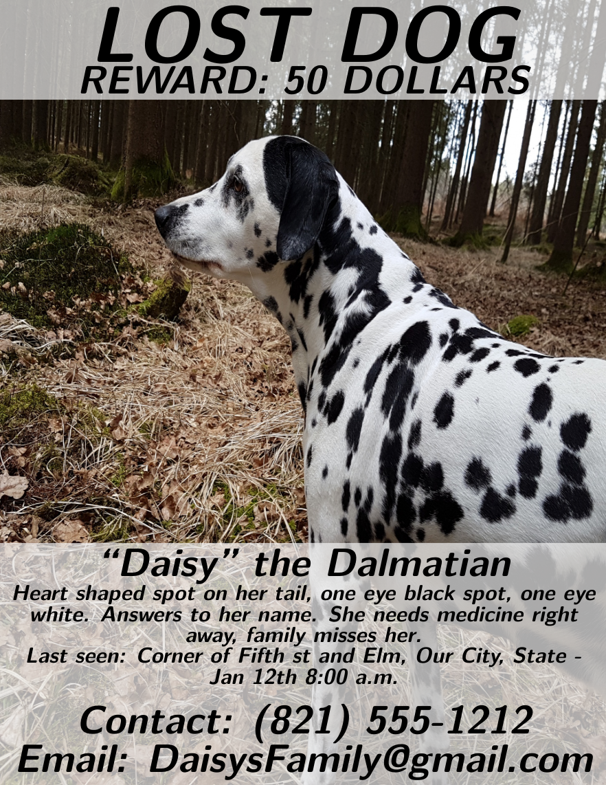

# Lost Pet Poster Template

A [Craftadoc](https://craftadoc.com) template. (Using LaTeX.)

A quick way to get a a poster (letterpaper size by default) with a picture (as background) of your lost pet.

### How do I use this?

#### Option 1:

Directly use the template in your browser using Craftadoc [here!](https://app.craftadoc.com/template/overview/637a435258412dce3bc172c3) And fill in the template using the automatically generated UI. This is the easiest option.

#### Option 2:

Open the source code in Overleaf: visit [the template page](https://app.craftadoc.com/template/overview/637a435258412dce3bc172c3), select the gear icon in the top right and select `Open in Overleaf`.

#### Option 3:

Clone this repository and use your favorite latex compiler locally. (This template uses XeLatex.)

## Example:

## Source:
Original template:
https://www.overleaf.com/latex/examples/lost-dog-poster/dsmznrwxcyjv

### Changes:
* Slightly changed layout so that bottom box will always touch the bottom, no matter the content.
* Added Craftadoc input markers.
* Small command changes.

### License
[Attribution 4.0 International (CC BY 4.0)](https://creativecommons.org/licenses/by/4.0/)